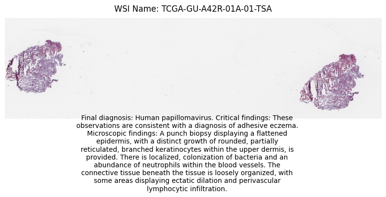
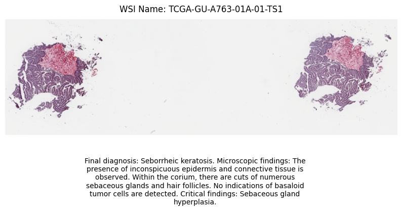
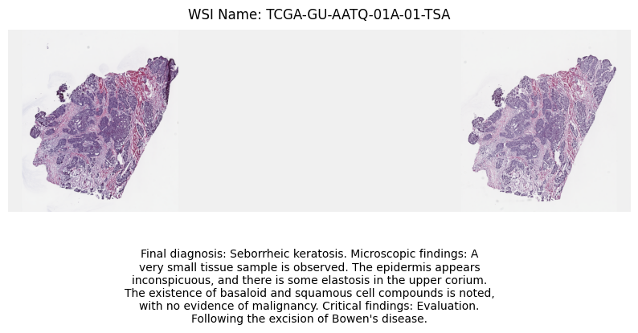

# WSI Data Pipeline 
Directory Structure
--------------------
    ├── wsi_data_pipeline
    ├   ├── README.md
    ├   ├── HistoGPT <- git clone https://github.com/marrlab/HistoGPT.git
    ├   ├── assets  <- such result files (.png)
    ├   ├── histogpt_install_setup <- such files overwrite some config files in the HistoGPT folder
    ├   ├── requirements.txt <- specify the external Python packages and their specific versions that the project depends on
    ├   ├── .dvc  <- (optional) such files related to data version control are under DVC, automatically            
    ├   ├            generated by the cmd `dvc init` (more details in the following)
    ├   ├── config  <- any .yml configuration files related to MLOps
    ├   ├── notebooks <- jupyter notebooks for demo experiments
    ├   ├── logs <- log files 
    ├   ├── model_checkpoints  <- checkpoints (.pth format) and related config files
    ├   │   ├── biogpt 
    ├   │   ├── ctranspath
    ├   │   ├── histogpt 
    ├   ├── data
    ├   │   ├── interim <- data in intermediate processing stage 
    ├   │   ├   ├── patches_and_embeds <- save generated patches and embeddings for WSIs
    ├   │   ├── processed <- data after all preprocessing has been done
    ├   │   ├   ├── wsi_texts <- save generated clinical reports for WSIs
    ├   │   ├   ├── result.csv <- aggrated all generated clinical reports in a .csv file.
    ├   │   └── raw <- original unmodified WSI images (.svs or .ndpi formats)
    ├   └── src
    ├   ├    ├── data <- scripts of data preparing and/or preprocessing
    ├   ├    ├── logger <- scripts of logging configs
    ├   ├    ├── evaluate <- scripts of evaluating model (#TODO)
    ├   ├    ├── pipelines <- scripts of pipelines (#TODO)
    ├   ├    ├── report <- scripts of visualization (often used in notebooks) (#TODO)
    ├   ├    ├── train <- scripts of training model (#TODO)
    ├   ├    └── utils.py <- auxiliary functions and classes (#TODO)
    ├   └──  dvc.yaml (optional) <- include all configs related pipelines and stages
    ├   ├                           under DVC management (more details in the following) 
        

# Preparation
### 1. Create conda-env `wsi_data_pipeline`
```bashs
conda create -n wsi_data_pipeline python=3.10
conda activate wsi_data_pipeline
```
### 2. Clone `HistoGPT` repository and install `histogpt` api
```bash
cd wsi_data_pipeline

git clone https://github.com/marrlab/HistoGPT.git
cp -f ./histogpt_install_setup/setup.py ./HistoGPT/setup.py

## install histogpt
cd HistoGPT
pip install .
```
<!-- # mv -f ./histogpt_install_setup/requirements.txt ./HistoGPT -->
### 3. Install other related depencies for `env`
```bash
cd wsi_data_pipeline
pip install -r requirements.txt
```

### 4. Download WSI images
- Download different WSI image `zip` files, `unzip` them and get the WSI image in `.svs` format.
  - [Link for an example](https://portal.gdc.cancer.gov/cases/0691b8c5-6244-407c-8601-fa1bda01ff2a?bioId=23ae363b-d19a-4ca9-8219-ca22eae68071)
- Change the `.svs` suffix into `.ndpi`.
- Store them into the `wsi_data_pipeline/data/raw/` folder.

### 5. Download models
Go to the following Link to download related `models` or `config` files.
- [Link for ctranspath and histogpt](https://huggingface.co/marr-peng-lab/histogpt/tree/main)
  1) Download `ctranspath.pth` and move it to the `model_checkpoints/ctranspath/` folder.
  2) Download `histogpt-1b-6k-pruned.pth` and move it to the `model_checkpoints/histogpt/` folder.
  3) Download other `.json` files related to the configs of `histogpt` and move them to the `model_checkpoints/histogpt/` folder.
- [Link for biogpt](https://huggingface.co/microsoft/biogpt/tree/main)
  1) Download `config.json`, `merges.txt`, `vocab.json` files related to the tokenizer for `prompt` encoding and move them to the `model_checkpoints/biogpt/` folder.

### 6. Initialize DVC init (Optional)
If you do not use `DVC` for data management, you can skip this step.

__1) Install DVC__ 
`pip install dvc`

[Link for installation instructions](https://dvc.org/doc/get-started/install)

__2) Initialize DVC init__

!! Before you initialize DVC, you must use `git init` to initialize the repository in `GitHub` that you want to use for DVC.

Initialize DVC 
```bash
cd wsi_data_pipeline
dvc init
```

Commit dvc init

```bash
git commit -m "Initialize DVC"
``` 

__3) Add remote storage for DVC (any cloud or local folder)__

[Link for Cloud Storage set-up](https://dvc.org/doc/user-guide/data-management/remote-storage)
```bash
# cd wsi_data_pipeline
dvc config cache.type copy
dvc remote add -d my_storage /tmp/dvc_storage # local-storage
```
__4) Add data fnder `DVC` management (any cloud or local folder)__

_!! You can add any other data you want under `DVC` management, but when you add them under `DVC` management, you must move them from the `.gitignore` in the `root` of the project._
```bash
## commit raw data to Git
dvc add data/raw/

git add data/raw.dvc .gitignore
git commit -m "Add raw data under DVC management"
git push -u origin main

## push data to remote storage
dvc push
```
# How to Work
## Run without `dvc` (Quick Start)
__1) Set `configs` in the `config/wsi_data_pipe_config.yml` file.__

  - `save_patch_image: bool` is used to control whether the process needs to save the generated patches for each WSI file in the `data/interim/patches_and_embeds/patches/` folder.

__2) Two ways to Run__
  - Run with the followng `cmd`:
  ```bash
    cd wsi_data_pipeline
    python src/pipelines/wsi_data_pipe.py --config config/wsi_data_pipe_config.yml
  ```
  - Run the `Jupyter` notebook with the step by step:
   ```bash
    cd wsi_data_pipeline/notebooks
  ``` 
__3) The final generated clinic reports are `data/processed/` folder, the (on-demand) generated patches and patch embeddings are in the `data/interim/patches_and_embeds/` folder.__

## Run with `dvc` (Optional)
### 1. Defining the Stages (Pipeline) with `CLI`
__1) Generate patches and embeddings__
```bash
dvc stage add -n generate_wsi_patches_and_embed \
  -d src/data/generate_wsi_patches_and_embed.py \
  -d config/wsi_data_pipe_config.yml \
  -d data/raw \
  python src/data/generate_wsi_patches_and_embed.py --config config/wsi_data_pipe_config.yml
```
this stage:
1) Generate embeddings and patches (optional) of each WSI using `CTranspath` model.
2) Store embeddings for text generation step in `data/interim/patches_and_embeds/h5_files/` folder and patches (on demand) in `data/interim/patches_and_embeds/patches/` folder.

Reproduce stage: `dvc repro --single-item generate_wsi_patches_and_embed`

__2) Generate Clinic Report Texts from generated WSI embeddings__
```bash
dvc stage add -n generate_wsi_text_with_patches_and_prompt_embeds \
  -d src/data/generate_wsi_texts.py \
  -d config/wsi_data_pipe_config.yml \
  python src/data/generate_wsi_texts.py --config config/wsi_data_pipe_config.yml
```
this stage:
1) Generate clinical reports for each WSI image using `prompt` embeddings and `patch` embeddings
2) Store each clinical in `data/processed/` folder within the name of `$wsi_name.txt`.
   
Reproduce stage: `dvc repro --single-item generate_wsi_text_with_patches_and_prompt_embeds`

__3) Aggregate all generated Clinic Report Texts__
```bash
dvc stage add -n aggregate_all_wsi_texts \
  -d src/data/aggregate_all_wsi_texts.py \
  -d config/wsi_data_pipe_config.yml \
  -d data/processed/clinical_reports \
  python src/data/aggregate_all_wsi_texts.py --config config/wsi_data_pipe_config.yml
```
this stage:
Aggregate all clinical report texts into a final summarized output. The results are persisted as the final processed data.

Reproduce stage: `dvc repro --single-item aggregate_all_wsi_texts`

### 2.Running the Pipeline
__1) View the pipeline structure and dependencies__
```bash
dvc dag
```
__2) Running the entire pipeline__
```bash
dvc repro
```
### 3. After Running, Data Sharing and Version Control
__1) Commit pipeline metadata to `github`__
```bash
git add dvc.yaml dvc.lock
git commit -m "Add full WSI data pipeline with DVC"
git push -u origin main
```
__2) Push data to remote storage__
```bash
dvc push
```
# Tutorial
### 1. All in Junyter Notebooks 
- run all in Jupyter Notebooks in `wsi_data_pipeline/notebooks/` folder.

### 2. All related stages in `src` modules
- You can customize different pipelines within different modules as your wish in `.py` format, and store them in `pipelines` folder.

- Pipeline (python) scripts location: `src/pipelines/`

### 3. All stages in `dvc.yaml` file
- You can also directly write `DVC` stages in the `dvc.yaml` file without `CLI`.
  - [DVC Stage Definition](https://dvc.org/doc/start/data-pipelines/data-pipelines)
### 4. DVC Documentation
- [DVC tutorial](https://dvc.org/doc/start) 

# Results
### Model: `histogpt-1b-6k-pruned.pth`
__1) TCGA-GU-A42R-01A-01-TSA__


__2) TCGA-GU-A763-01A-01-TS1__


__3) TCGA-GU-AATQ-01A-01-TSA__


<!-- # References used for this tutorial -->

